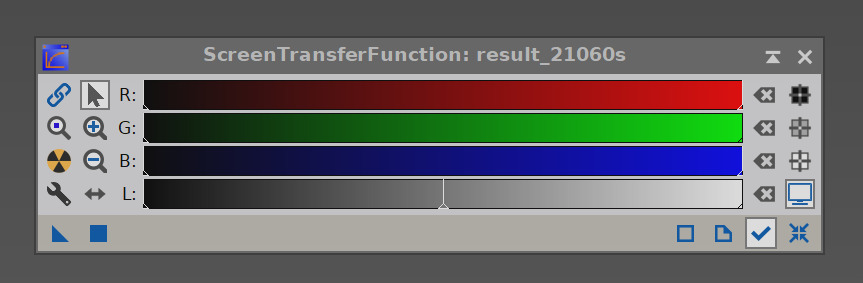

# Zpracování fotek v Pixi

## BPP (Batch preprocessing)

Otevřeme v script -> Batch Processing -> BatchPreprocessing

Načteme snímky přes Add Bias, Add Darks, Add Flats, Add Lights, pokud už máme mastery stačí přidat pouze jeden (nutné potom zakliknout use master vpravo)

zaklikněte CFA images pokud jsou obrázky barevné

dvojklikem na jeden light ho nastavíte jako registrační snímek (snímky se zarovnávají na něj)

nastavte output directory

poté už jenom klikněte na Diagnostics a Run, počkejte dlouhou dobu

## Základní věci
Ctrl + A pro strečování fotky, Ctrl + F12 pro odstrečování
globální aplikace přes čtvereček, na jednu fotku přetažením trojúhelníku

## Dynamic crop

Ořízněte okraje fotky (kde jsou chyby po složení), popřípadě opravte kompozici. Aplikace kliknutím na fajfku.

## Screen Transfer Function

STF - unlink channels (řetěz) - stretch (radiační ikonka)

## Dynamic background extraction

pro začátek je nutné kliknout na obrázek, umístí se kříž

threshold 4, sample radius podle hustoty hvězd, pokud vysoká tak nižší (dobrá starting value 10, resize all)

rozmístit od okrajů do středu tak, aby byl zachycen gradient, ne málo ane ani ne moc vzorků

vzorek neumisťovat na místa, která se zobrazí jako černá (je tam hvězda)

tohle ne

v target image correction vybrat subtraction, aplikace trojúhelníčkem, vygeneruje se pozadí a fotka s odečteným pozadím

## Color calibration

Alt+N - tmavé místo, Alt+N přes celou mlhovinu - white reference

## Photometric color calibration

Pro kalibraci barev lze použít i photometric color calibration
Pokud jsou metadata o pozici v obrázku (lze vložit přes script -> image analysis -> image solver), stačí kliknout na acquire from image, pokud ne tak vyhledejte objekt který jste fotili přes search coordinates

## Background Neutralizaiton

black reference z vybraného samplu v minulém kroku

## Masky

Extrahovat jasovou složku nahoře v liště (dobré setnout identifier)

## Dekonvoluce
### Dynamic PSF

vytvoříme fotku průměrné hvězdy

vybírat hvězdy které nejsou v úplně saturaci (odsaturovat přes CTRL + F12, ty hvězdy co jsou i po odstrečnutí nevybírat)
poklikat osamocené hvězdy

kliknout na foťáček a objeví se průměrná hvězda

### Curves transformation na masku

esovitá křivka tak aby maska byla více kontrastní (***aby zůstala mlhovina, ale černá černou byla*** - JV, 2024)

živý náhled se zobrazí přes prázdné kolečko

aplikovat konvoluci na masku, základní nastavení (neaplikovat na barevnou)

### Stretch masky

ScreenTransferFunction + HistogramTransformation
trojúhelník z STF na dolní lištu histo, pak trojúhelník z histo na masku

maska by měla zbělat (strečuje se strečlé), tedy odstrečněte přes Ctrl + F12

### Přetáhnout zkonvoluvanou masku na obrázek pod jeho název (na levo)
Ctrl+K pro zmizení červené
(pokud potřeba Ctrl+Shift+I pro inverzi)

### Dekonvoluce

Alt+N pro menší místo obrázku (přes mlhovinu i pozadí), operace je výpočetně náročná
v záložce ExternalPSF nahrát vygenerovanou hvězdu
počet iterací 50 (pokud míň powerful počítač ubrat)
doporučení pro úvodní čísla pro deringing:
- global dark  - 0.0070
- global light - 0.0003
pokud rozplizlé hvězdy, snížit global dark
pokud černé kroužky kolem, zvýšit global dark
vyzkoušet i na prewiev s velkými hvězdami, pokud ty jsou špatně, nutné udělat extra masku na velké hvězdy

### StarMask

vezmeme původní fotku po DBE
- scale 5
- large scale 2
- small scale 2
- compensation 3
- smoothness 16, aggregate, binarize
- shadows 0
- midtones 1/2
- highlights 1
- truncation 1
- limit 1

Poté v dekonvoluci vybrat local support tuto star masku, a aplikovat znovu
Pokud vše ok, aplikovat na celou fotku a dát si kafe

Odebrání masky přes křížek nahoře

## Streč fotky
streč přes STF + Histo Transformation
přetáhnou trojúhelníček z STF na dolní lištu HistogramTransformation, poté trojúhelníček z Histo na obrázek

## SCRN

odstranění zelené z fotky

## Zvýšení saturace u mlhoviny
***S***(esovitá) křivka na masku (CurvesTransformation)
aplikovat masku na obrázek
nyní znovu curves transformation, záložka saturace (S), potom klidně i čistě curves na barvy pod kanály R, G, B / RGB / S

## Export

menu file -> save as

do 16-bit TIFF

## Starnet++

Nyní fotku prohnat Starnet++

## PixelMath

odečíst starnet fotku od původní - fotka pouze s hvězdami
a - b

## Finální úpravy
otevřít fotku v PS, spojit vrstvy přes Linear Add
(popřípadě poupravit v camera raw, zvýšit saturaci, kontrast apod)