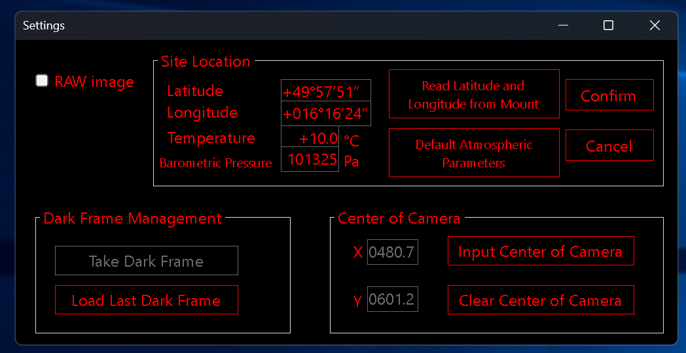
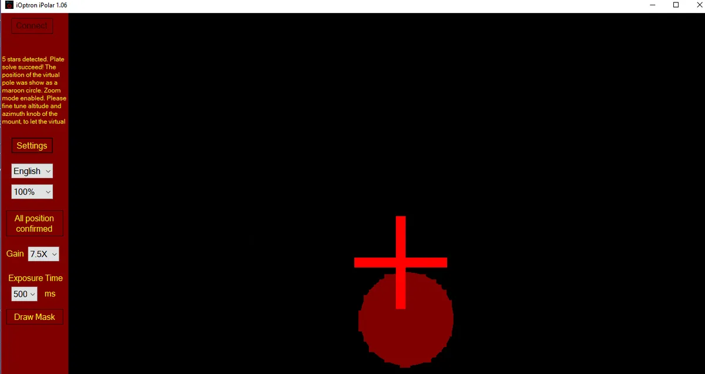

# **S**ítiny **A**stro **J**oint **R**esearch **I**nstrument (S.A.J.R.I.)

## Seznam techniky
   * Teleskop - TS Photoline Apo 115mm f7
      * ohnisková vzdálenost $800$ mm
      * reduktor 0.79x (výsledné ohnisko tedy $630$ mm)
   * Kamera - Touptek 2600CP
      * velikost senzoru $23.5 \times 15.7$
      * rozlišení $6224 \times 4168$ px
      * velikost pixelu $3.8\ \mu \text{m}$
   * Montáž - iOptron CEM 70
   * Guiding
      * kamera - ZWO Asi mini 120mm
      * guide scope - ohnisková vzdálenost $328$ mm 
   * Ovládání
      * software - [N.I.N.A.](/nina/)
      * počítač - UMax N10 Plus (Intel NUC N100) (8G RAM / 125G SSD)
      * připojení pomocí RDP přes lokální síť / přes WiFi hotspot

## Instalace SW
Zde je uveden seznam kroků pro instalaci nového ovládacího zařízení pro robotizovanou sestavu ovládanou přes software N.I.N.A (Windows). Alternativou je ovládání přes Astroberry / Stellarmate využívající Indi/Ekos, ten zde ale uvádět nebudeme. Pro samotné ovládání prosím přejděte na sekci [N.I.N.A.](/nina/).

   * Stáhněte a nainstalujte software a drivery z mirroru na [http://omega.swpelc.eu/expa/software/](http://omega.swpelc.eu/expa/software/), nebo přímo z originálních stránek dle tabulky níže:

| Název | Stáhnout ze zdroje |
:-------:|:-------------------:|
3339_iOptron_iPolar.exe | https://www.ioptron.com/v/firmware/3339_iOptron_iPolar.exe
ASCOMPlatform702.4675.exe | https://ascom-standards.org/Downloads/Index.htm |
astap_setup.exe | https://www.hnsky.org/astap.htm |
d80_star_database.exe | https://www.hnsky.org/astap.htm
iOptronCommander_ASCOM_DriverInstaller9070.exe | https://www.ioptron.com/Articles.asp?ID=325 |
NINASetupBundle_3.2.0.1067.zip | https://nighttime-imaging.eu/download/ |
phd2-2.6.11-installer.exe | https://openphdguiding.org/downloads/ |
ZWO_ASCOM_Setup_V6.5.17.exe | https://www.zwoastro.com/software/ |
ZWO_ASI_Cameras_driver_Setup_V3.22.exe | https://www.zwoastro.com/software/ |

 

### Potřebný software a jeho funkce:

* ASCOM Platform \- univerzální software propojující všechnu možnou astro-techniku  
* iOptron iPolar \- software pro montáže iOptron a jejich polární hledáčky  
* TeleskopASCOM \- ascom driver pro montáž CEM 70
* ZWO ASCOM \+ Cameras \- ascom driver pro ZWO  
* ASTAP \- plate solving program (pro automatické navádění a zarovnání fotek)  
* iOptron commander \- software pro ovládání iOptron montáží  
* PHD2 \- software pro guiding  
* N.I.N.A. \- software pro kontrolování všech možných součástí robotického dalekohledu  

## Jak ustavit montáž

Pří prvním zapnutí (a připojení USB kabelu do polárního hledáčku) je nutné nejdříve nastavit GPS souřadnice pozorovacího místa (v panelu settings). A poté (s ještě stále zakrytým polárním hledáčkem) pořídit dark snímky. Po pořízení darků je možné je při každém dalším ustavování montáže pouze zvlolit možnost *Load last dark frame*.

Pro samotný alignment stačí sledovat červenou tečku a otáčením stavicích šroubů pro pohyb vlevo/vpravo a za použití inbusu pro pohyb nahoru/dolů ji dostat na střed kříže. Jakmile bude správně ustaveno, tečka zezelená.

Dále by již mělo stačit zapnout software N.I.N.A. a ovládat dalekohled přes něj.

Předpřipravené profily lze nalézt [ZDE](http://omega.swpelc.eu/expa/nina/Profiles/), pro jejich instalaci je nutné zkopírovat složku *Profiles* do složky **C:\\Users\\\<USERNAME\>\\AppData\\Local\\NINA\\Profiles**.