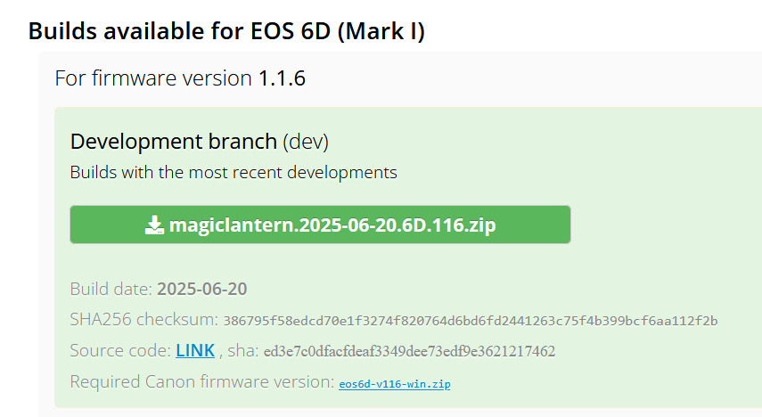
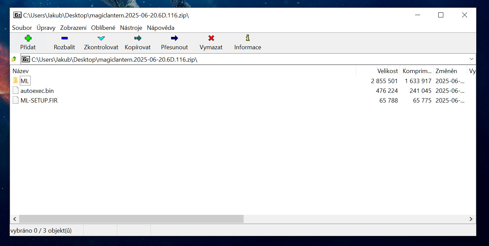

# Magic lantern

Magic lantern je open-source firmware pro DSLR fotoaparáty Canon, který přináší pokročilé funkce a možnosti, které nejsou v základu dostupné ve standardním firmware samotného fotoaparátu. My ho budeme používat pro nastavení expozičního času delšího než $30$ sekund a pro automatické snímání.

## Instalace

Stáhněte si verzi určeného pro typ vaší zrcadlovky (pozor například na rozdílné verze pro 6D MkI a MkII), pozor také na potřebnou verzi originálního Canon firmware (například právě pro 6D je to verze 1.1.6).

Stažený zip vyextrahujete do root složky SD karty fotoaparátu a kartu vložte zpět.

V nastavení fotoaparátu přejděte do menu a klikněte na firmware version a update.

<Inline style="width: 49%">img/fwversion.jpg</Inline> <Inline style="width: 49%">./img/update.jpg</Inline>

